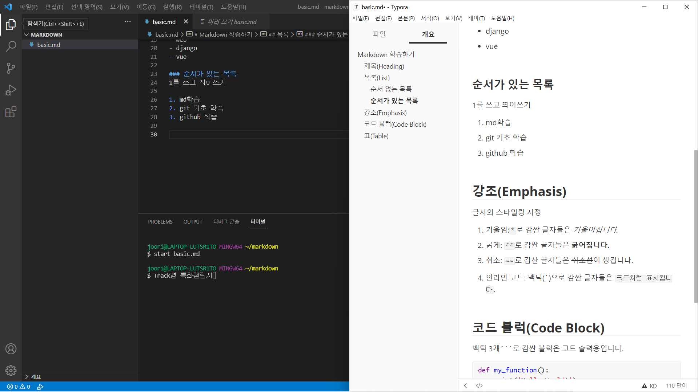

# Markdown 학습하기


## 제목(Heading)

가장 큰 제목부터 ~ 6번째로 큰 제목까지 존재

#의 개수로 제목의 중요도를 지정

# #(h1)입니다.

## ##(h2)입니다.

### ###(h3)입니다.

#### ####(h4)입니다.

##### #####(h5)입니다.

###### ######(h6)입니다.


## 목록(List)

순서가 있는 목록(ordered list)과 순서가 없는 목록(unordered list)가 있다.


### 순서가 있는 목록

`1.` 를 쓰고 띄어쓰기

1. md학습
2. git 기초 학습
3. github 학습


### 순서 없는 목록

`-` 혹은 `*`를 앞에 붙이고 띄어쓰기

- python
- js
- web
- django
- vue


## 강조(Emphasis)

글자의 스타일링 지정

1. 기울임:` *`로 감싼 글자들은 *기울어집니다.*
2. 굵게: `**`로 감싼 글자들은 **굵어집니다.**
3. 취소: `~~`로 감산 글자들은 ~~취소선~~이 생깁니다.

4. 인라인 코드: 백틱(\`)으로 감싼 글자들은 `코드처럼 표시`됩니다.


## 코드 블럭(Code Block)

백틱 3개```로 감싼 블럭은 코드 출력용입니다.

```python
def my_function():
    print('Hello World!')
```


## 표(Table)

| 이름 | 전공 | 나이 |
| ---- | ---- | ---- |
|      |      |      |
|      |      |      |


## 가로선

`---`를 입력하시면가로선이 생성됩니다.

---


## 링크 & 이미지

복사 => 붙여넣기 하시면 자동으로 추가됩니다.




## 수식(Latex)

> 원래 마크다운은 지원하지 않으나, Typora가 추가적으로 지원하는 기능